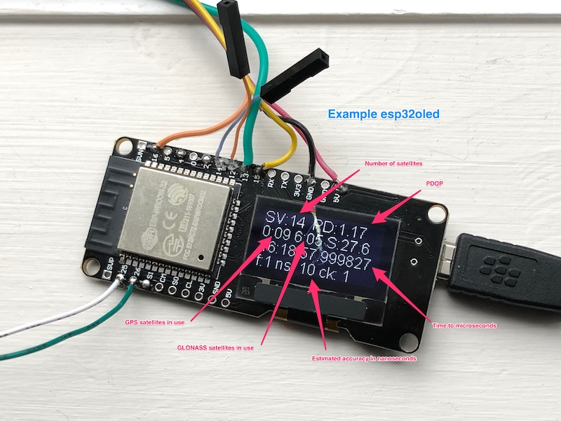

# u-blox-m8
A library for managing u-blox m8 GNSS receivers, particularly suited for precision timing applications.

# Background
This is a library for managing the u-blox M8 series of GNSS (“GPS”) receiver modules. It is particularly suited for precision timing applications and is key part of the OpenPPS project. It uses the u-blox UBX binary protocol exclusively.

Why did I create yet another u-blox library? First of all I wanted it to be processor independent as much as possible and in particular I wanted it to run on the ESP32. Secondly I wanted to take advantage of some of the unique features of the u-blox M8 receivers for optimizing their use for timing applications. Finally, the way others handle the data stream from the receiver and in particular the parsing of the packets wasn't the way I like to do things like this :-)

The most common variants of the M8 family appear to be the M8Q and M8N which as far as I can tell just have different physical form factors. There are also LEA and NEO versions of the M8N and once again these appears to be just different sizes and pin arrangements.

From a precision timing perspective the M8 modules produce PPS (pulse-per-second) pulses with accuracies compared to UTC in the 10s of nanoseconds range. They are also capable of sustaining this indoors in a surprising number of situations and the modules themselves can be configured to continue to provide PPS even when the module temporarily loses lock.

The M8 modules can also be configured to provide pulses that are more or less than once a second and also produce precise frequencies on the PPS pin instead of timing pulses.

To achieve maximum timing accuracy u-blox recommends that PPS be configured for once a second and that SBAS satellite correction services be disabled. It appears the the M8 modules can take advantage of a combination of GNSS systems and in North America the combination of GPS and GLONASS is available and appears to work extremely well.

This library has the following features:

* The library is contained in a single header file u-blox-m8.h which makes it easy to integrate into a project.
* It works best with hardware serial ports such as on the ESP32, Teensy and Adafruit M0 and M4 boards.
* It depends on the main program to read from and write to the M8 receiver so the library is hardware independent.
* The UBX parser is state machine based with single byte input which means it will not hold up the main loop when called from there.
* It includes functions to configure the receiver for best timing performance and to monitor estimated accuracy.
* Examples are provided for testing the library on an ESP32 board.

The library does not directly deal with handling PPS pulses. A lot more information on that topic will be available in the upcoming OpenPPS project but for now here are some early notes on Google Docs: [OpenPPS](https://docs.google.com/document/d/1pgH2th--3oKmDTbd7h-_LfCK9mh3-_iBnJRLkP1W2Xk/edit?usp=sharing)

The reference document for the u-blox M8 receiver is here: [M8 Protocol Description](https://www.u-blox.com/sites/default/files/products/documents/u-blox8-M8_ReceiverDescrProtSpec_(UBX-13003221)_Public.pdf)

# Using the Library

This library is organized in a format suitable for development with PlatfromIO. To manually install it download the project from Github in a zip file and unpack it in your PlatformIO projects folder. Then open a terminal from the PlatformIO toolbar (a terminal, not the serial terminal) and navigate to the project folder. Type the command 'pio init' to initialize the project then it can be opened from the PlatformIO home page in your IDE.

The example program esp32basic shows a simple use of the library and should run on any ESP32 and probably many other processors. This will be the main program that is compiled unless the option in platformio.ini is changed.

The example program esp32oled requires the ESP8266_SSD1306 library by Daniel Eichhorn which can be installed in PlatformIO from the home page. This is for one of those inexpensive boards that include a 128x64 OLED. The part for displaying on the OLED is minimal and can easily be removed.

It should be possible to use this library with the Aruino IDE as well but I have not tried that at this point in time. I am pretty sure that it is going to require processors with hardware serial ports as the UBX protocol can have packets that are quite large (typically 280+ bytes for the UBX-NAV-SAT message) and it can be tricky to avoid losing packet bytes even with hardware serial ports because the rx buffer is a maximum of 256 bytes.

U-blox receivers can save their configuration on receipt of a UBX command however this is probably never a good idea, especially from a developer’s perspective. This library is going to be easiest to use if the receiver is in its default configuration to start with and during development it is important to remember that after you have changed something (like for example the baud rate) it will remain that way until the receiver is power cycled. It is easy to structure commands so that this doesn’t matter. For example if we are changing the baud rate from the default of 9600 to 115200 that command will be ignored if the baud rate is already 115200 which is fine but if we want to change our code so the baud rate is different from 115200 then the power needs to be cycled before we can test that. Just saying!

An important thing to note is that there is only one buffer for incoming messages and it is associated with the parser. This is only going to be a problem when we want to see the current configuration and change it.

Keep in mind that that messages from the receiver can either be periodic or polled. Once you have periodic messages enabled then you can’t be sure when you issue a poll command for another message that you will get the one you want next. That is probably only an issue when the message being polled is going to be used for configuration as mentioned in the previous paragraph. In that case you will want to poll the message to get the existing configuration data and then as soon as that message is received make the desired changes and then send the message back. There are examples of how to do this in esp32oled.cpp.
